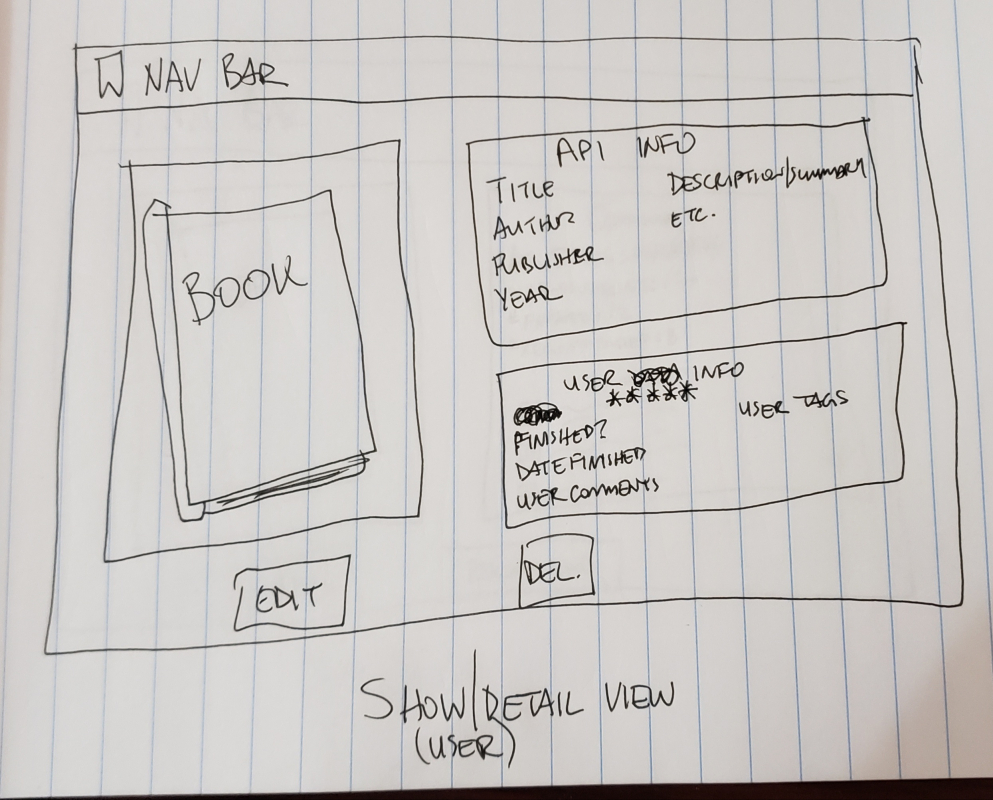

# Bookmark
An app for readers to log their books read, comment on those books, recommend to friends, and receive recommendations on what to read next.

---

## Built With

* Python
* Django
* SQL
* HTML
* CSS

---

## User Story
The user will be able to:
* Log in and view and edit their profile and preferences
* See a summary of their interactions with the site (books read, currently reading, favorite genres, etc.)
* Search for books to add to their bookshelf utilizing Open Library's API.
* See their friends' books including what they're currently reading
* Rate books and leave reviews
* Recommend books to friends and receive recommendations

---

## Wireframes

---

## ERD

---

## Route Tables

---

